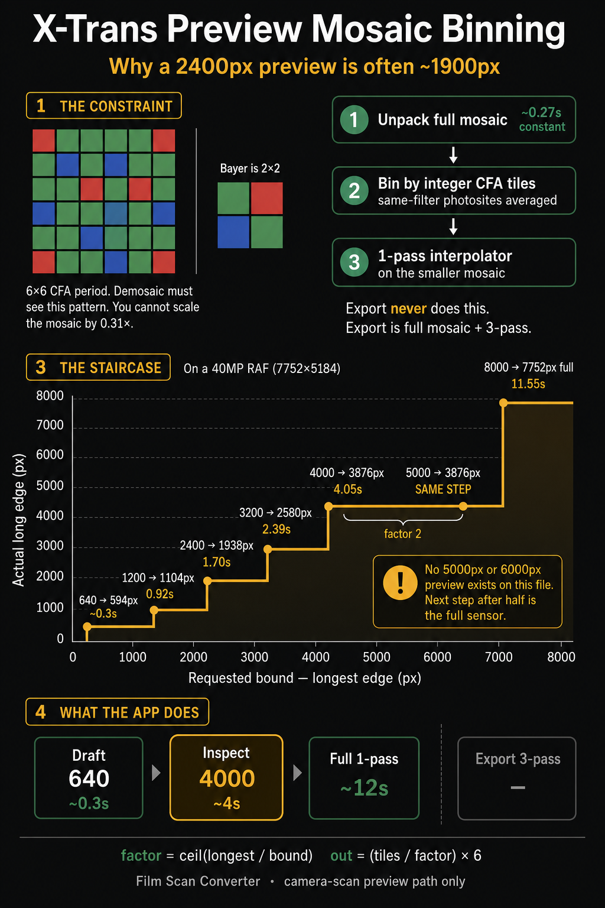

# X-Trans Preview Mosaic Binning

Why a “2400px preview” is often ~1900px, why 4000px and 5000px can be the
same image, and why the inspect preview stops at half the sensor instead of
something in between.



This is the camera-scan **preview** path only. Export still unpacks the full
mosaic and runs three-pass Markesteijn. It never calls the shrink described
here.

Code: `shrinkMosaicToBound` in
[`native/FilmScanEngine/Sources/CLibRawShim/RawTherapeePipeline.cpp`](../../native/FilmScanEngine/Sources/CLibRawShim/RawTherapeePipeline.cpp).

## The constraint

X-Trans is a **6×6** colour filter array. Bayer is **2×2**. Demosaic has to
see that repeating pattern. You cannot scale the mosaic by an arbitrary
fraction (0.31×, 0.47×, …) without destroying which photosite is R, G, or B.

So the preview shrink is not “resize the RAW to `maxDimension` pixels.” It
is:

1. Unpack the **full** compressed mosaic (Fuji unpack is already parallel;
   this cost is roughly constant, about 0.27–0.31s on the development 40MP
   RAF).
2. Bin the mosaic by an **integer number of CFA periods**, averaging
   same-filter photosites, so the 6×6 (or 2×2) pattern is unchanged.
3. Run the **1-pass** interpolator on that smaller mosaic.

The interpolator therefore never sees 40 million photosites for a preview.
That is why a 640px draft can appear in ~0.3s and a ~4000px inspect preview
in ~4s, instead of waiting for a full-sensor 1-pass (~12s) or three-pass
export.

## The formula

From the unpacked visible size `(W, H)` and the requested `maxDimension`:

```
longest = max(W, H)
period  = 6 if X-Trans else 2
factor  = ceil(longest / maxDimension)     # integer, at least 2, or no shrink
outW    = (W / period / factor) * period   # integer division
outH    = (H / period / factor) * period
```

`factor` is counted in **CFA tiles**, not pixels. Each output photosite is
the average of a `factor × factor` block of the **same** filter, stepped by
`period` pixels. Linear size drops by `factor`, not by `factor × period`.

If `longest <= maxDimension`, shrink is skipped and you get the full mosaic
(then 1-pass demosaic).

If `maxDimension` is omitted/`0` and this is **not** a `full_resolution`
decode, X-Trans takes a different shortcut: interpolate the **full** mosaic,
then `2×2` downsample the RGB result. That is slower than mosaic binning
and is not what the app preview stages use. The selected-file full preview
passes a huge positive bound (`100_000`) so shrink is a no-op **and** that
post-demosaic 2×2 path stays off.

## The staircase

`ceil(longest / bound)` only takes integer values 2, 3, 4, … so requested
bounds collapse onto a few actual sizes. On one 40MP X-Trans RAF
(`sample-raw/cinestill800t/DSCF3247.RAF`), processed full size is
**7752×5184**. Tile counts are 1292×864 (divisible by 6).

Measured 2026-08-18, camera-scan 1-pass, three repetitions, median wall
time (unpack is ~0.27s in every row):

| Requested bound | `factor = ceil(7752 / bound)` | Actual pixels | Wall | Demosaic |
|---|---|---|---|---|
| 640 | 13 | 594×396 (then fit-capped) | ~0.3s | (unpack-dominated) |
| 1200 | 7 | **1104×738** | 0.92s | 0.42s |
| 2400 | 4 | **1938×1296** | 1.70s | 0.98s |
| 3200 | 3 | **2580×1728** | 2.39s | 1.43s |
| 4000 | 2 | **3876×2592** | 4.05s | 2.38s |
| 5000 | 2 | **3876×2592** (same) | 4.06s | 2.38s |
| 8000 | no shrink (`7752 ≤ 8000`) | **7752×5184** | 11.55s | 6.65s |

There is **no** preview that is “about 5000px” or “about 6000px” on this
file. Anything from 3876px up to 7751px is factor 2 (~half). The next step
is the full sensor.

That is why the old “2400px detail preview” often looked like ~1200–2000px
in the badge: 2400 requested → factor 4 → **1938px** on this body. A 1200
request is factor 7 → **1104px**. Asking for 2400 does not interpolate at
2400.

Bayer (period 2) has a finer staircase, but it is still integer-only:
half, third, quarter, …

## What the app does with this

Interactive RAW decode is staged on those landings, not on a continuous
scale:

| Stage | Requested bound | Typical landing (this 40MP RAF) | Role |
|---|---|---|---|
| Draft | 640 | ~594px, ~0.3s | First paint, colour-accurate |
| Neighbour lookahead | 3200 | ~2580px, ~2.4s | Next unseen files while you stay on the current one |
| Inspect | 4000 | ~3876px, ~4s | Selected-file zoom/pan within ~5s. Same image as a 5000 bound |
| Full preview | 100000 (no shrink, 1-pass) | 7752×5184, ~12s after inspect | Lazy; not export |
| Export | `full_resolution`, 3-pass | 7752×5184, slower | Discarded after write |

Inspect is 4000 rather than 3200 because 3200 is only 2580px and 2.4s;
4000 uses the rest of a ~5s budget to reach half-res. 5000 would not buy
more pixels. Lookahead stays at 3200 so neighbour work does not wait on
the selected-file inspect pass.

Switching away demotes a full preview back to inspect size by resizing the
already-decoded buffer (no second RAW decode). If the cache is tight,
inspect sessions can drop further to 3200.

## Worked example

Same file, bound = 4000:

```
longest = 7752
factor  = ceil(7752 / 4000) = 2
tilesX  = 7752 / 6 = 1292
outTilesX = 1292 / 2 = 646
outW = 646 * 6 = 3876
```

Each output G (or R, or B) photosite is the average of a 2×2 block of the
**same** filter, 6 pixels apart in the original mosaic. The interpolator
then sees a real X-Trans CFA at 3876×2592, not a mashed RGB thumbnail.

Below one AHD tile (512px), the 1-pass X-Trans interpolator refuses the
frame and the shim falls back to linear interpolation. That is why the
640 draft is allowed to be a bit soft: it is still camera WB + colour
matrix, but not Markesteijn.

## How to re-measure

```sh
FSC_PREVIEW_BOUND_SWEEP=1 swift test --package-path native/FilmScanEngine \
  --filter cameraScanPreviewBoundLatencySweep
```

The sweep prints requested bound, actual `width×height`, wall, unpack, and
demosaic. A new camera size moves the landings; the staircase rule does
not.
